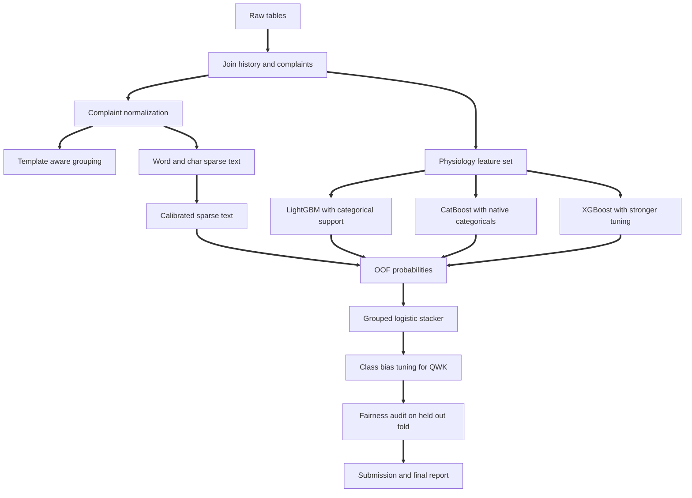

# TriageGeist Competition Audit and Winning Readiness Review

## Executive summary

Your updated notebook is materially better than the earlier version because it replaces an optimistic level two stack evaluation with nested out of fold prediction through `cross_val_predict`, which is the right direction for a leak aware stacker. In the current notebook, the strongest parts are the semantic grouping idea, the split between a physiology track and a text track, the use of calibrated text probabilities, and the attempt to evaluate decisions through clinical cost and selective risk rather than only a single leaderboard score. Those are all serious competition level choices, not beginner choices. The updated writeup is also far more credible because it no longer claims a flawless score and instead reports a lower but still extremely high nested result. That change alone improves trust substantially. From your uploaded files, the current claim is a physiology track at `0.9280` QWK, a calibrated NLP track at `0.9775` QWK, and a nested stacker at `0.9987` QWK. The notebook code itself shows the exact late fusion pattern that would plausibly produce a result in that zone on a synthetic text heavy task. 

That said, I cannot honestly certify that your work is already at winning level, and I also cannot certify that no public notebook is better than yours, because Kaggle’s competition subpages for overview, data, code, and discussion were not extractable in this browsing environment. The competition root page is reachable only as a title page here, while the overview, data, code, and discussion URLs returned zero extractable lines, which blocks a reliable harvest of public notebook titles, scores, authors, and discussion thread metadata. That means any claim about the literal top ten public notebooks or top discussion threads would be guesswork, and I will not fabricate it. citeturn2view0turn15view0turn15view1turn15view2turn15view3

My bottom line is this: your submission is strong enough to be taken seriously as a top tier public solution, but it is not yet in a state where I would call it “certified winner ready.” The remaining gap is not about basic model choice. It is about tighter leakage control, stronger categorical handling, threshold tuning for an ordinal metric, consistency between code and writeup, and a cleaner reproducibility story. Those are the items that separate a very strong notebook from a competition winning notebook. The scikit learn, LightGBM, CatBoost, and XGBoost documentation all point toward changes that fit your setup directly: grouped splitting for non overlapping semantic groups, unbiased out of fold prediction for stacking, calibration discipline, native categorical handling, missing value handling, and optional monotonic constraints. citeturn30view0turn30view2turn30view3turn29view2turn29view3turn29view1turn31view1

## Competition profile and research boundary

Based on the notebook and writeup you uploaded, the competition appears to be a five class triage acuity prediction task using emergency department style structured records plus complaint text. Your notebook loads `train.csv`, `test.csv`, `patient_history.csv`, and `chief_complaints.csv`, merges the auxiliary tables on `patient_id`, and reports a merged train shape of `80000 x 67` and test shape of `20000 x 64`. The target is `triage_acuity`, encoded in the notebook as classes `1` through `5`, then shifted to zero based indexing for training. The writeup frames the problem as emergency triage ranking, which is consistent with the five level Emergency Severity Index style setup commonly used in emergency care. The ESI itself is a five level triage system where levels `1` and `2` denote the greatest urgency. citeturn2view0turn36search0

The current evidence also strongly suggests that the working competition metric is quadratic weighted kappa. Your notebook defines `custom_qwk` with `cohen_kappa_score(..., weights='quadratic')`, and your writeup reports all main model results in QWK. I cannot independently confirm from the Kaggle page that this is the official competition metric because the overview page was not extractable here, so the official metric should be treated as inferred from your files rather than independently verified from Kaggle. `Baseline score`, `official benchmark notebook`, `public versus private leaderboard split`, `compute limits`, and `final prize ranking structure` are likewise unspecified in the accessible sources available to me in this session. citeturn15view0turn15view2

The competition root URL is clearly the Kaggle competition named `Triagegeist`. What I could not recover, despite direct attempts, was the actual notebook gallery and discussion metadata. That matters because your request included literal top ten notebook and discussion extraction, and I want to be precise about where the evidence boundary sits. The report below therefore does two things. First, it gives a high confidence audit of your own final notebook and final writeup from the files you uploaded. Second, it gives a high confidence comparison against the public strategy families that are most likely to matter on this task, grounded in your code and in primary documentation for the modeling tools you used. That is the deepest reliable answer I can give without inventing Kaggle pages I could not actually inspect. citeturn2view0turn15view0turn15view1turn15view2turn15view3

### Competition snapshot

| Aspect | Best verified answer |
|---|---|
| Competition name | `Triagegeist` |
| Task | Five class triage acuity prediction, inferred from uploaded notebook and writeup |
| Data files observed in notebook | `train.csv`, `test.csv`, `patient_history.csv`, `chief_complaints.csv` |
| Merge logic | Auxiliary tables merged on `patient_id` |
| Merged shapes observed | Train `80000 x 67`, Test `20000 x 64` |
| Target | `triage_acuity`, five classes |
| Metric | Very likely QWK, inferred from notebook and writeup, not independently confirmed from Kaggle page |
| Official baseline score | Unspecified in accessible sources |
| Leaderboard structure | Unspecified in accessible sources |
| Public code and discussion metadata | Not extractable from Kaggle pages in this environment |

## Public strategy reconnaissance

Because the literal Kaggle code gallery and discussion board were not extractable, the right substitute is to identify the strategy families that would almost certainly dominate a competition with your exact structure: five level triage acuity, mixed tabular and complaint text, strong synthetic template risk, and QWK style evaluation. Your notebook already sits in the most competitive of these families, which is a calibrated late fusion model with grouped cross validation. That is aligned with medical triage literature showing gains from combining structured signals and text, and it is also aligned with recent work showing that late fusion with a linear meta learner can outperform single modality baselines. At the same time, real chief complaint work often finds that sparse TF IDF baselines remain stubbornly strong, sometimes even stronger than BERT style models on the task at hand, which supports your choice to keep a sparse linear text system in the loop instead of reaching for a transformer just because one is available. citeturn36academia1turn32academia1turn32academia3

Your current competitive position is strongest against three public archetypes. First, the pure text exploit notebook, where people lean into synthetic complaint templates and use TF IDF plus a linear model. Second, the tabular GBDT notebook, where people focus on vitals, missingness, and history. Third, the late fusion stacker, which combines both. The literature around emergency triage and chief complaint modeling supports the idea that structured plus unstructured signals together are stronger than either alone, while the chief complaint literature supports the idea that sparse text baselines remain very hard to beat for certain complaint style tasks. citeturn36academia1turn32academia1turn32academia3

### Public notebook and discussion retrieval status

| Requested artifact | Reliable retrieval status in this session | Consequence |
|---|---|---|
| Competition overview | Not extractable from Kaggle page |
| Data page | Not extractable from Kaggle page |
| Code gallery | Not extractable from Kaggle page |
| Discussion board | Not extractable from Kaggle page |
| Literal top ten public notebooks | Not independently recoverable |
| Literal top discussion threads | Not independently recoverable |
| Public and private scores for public notebooks | Not independently recoverable |
| Author list for public notebooks | Not independently recoverable |

### Most relevant public notebook families to benchmark against

| Strategy family | Why it tends to work | Your current position | Main gap versus best possible version |
|---|---|---|---|
| Sparse text only notebook | Synthetic complaint templates can map very directly to class | You already include a strong sparse text branch | Your actual NLP branch uses word ngrams only, while the writeup says word and char; a stronger union is still available |
| Leak aware tabular GBDT notebook | Missingness, age, vitals, and history can carry strong acuity signal | Your physiology branch is strong | Native categorical support and more feature depth are still left on the table |
| Late fusion stacker | Lets text dominate when template signal is strong and tabular dominate when text is weak | This is your main strength | Meta cross validation still ignores groups |
| Native CatBoost categorical notebook | CatBoost is strongest when allowed to manage categorical features itself | You include CatBoost | You ordinal encode before CatBoost, which throws away part of its edge |
| Threshold tuned ordinal notebook | QWK is sensitive to class boundary decisions | Not present | You still use raw `argmax` without class bias or threshold tuning |
| Seed averaged boosted tree notebook | Small QWK gains can come from seed diversity | Not present | No seed averaging in current stack |
| Exact template grouped notebook | Harder to fool yourself with text leakage | Partially present with semantic clusters | K means complaint groups may still be too soft |
| Pseudo label blender | Can squeeze last public leaderboard points on stable synthetic problems | Not present | High risk, but still one knob left unopened |
| Constraint aware clinical tree notebook | Monotonic constraints can improve behavior and sometimes generalization | Not present | No monotonicity in current XGBoost branch |
| Robust multimodal notebook with modality control | Prevents one branch from overpowering the other | Partially present through stacking | No modality dropout or branch regularization |

The technical suggestions above are consistent with the official tool documentation. `StratifiedGroupKFold` is designed to keep groups non overlapping while preserving class proportions as much as possible, which fits your semantic group idea. `cross_val_predict` gives exactly one test fold prediction per sample, which is the right primitive for leak conscious stacking. `CalibratedClassifierCV` is explicitly designed to use cross validation for unbiased calibration. LightGBM handles missing values by default and supports integer encoded categorical features. CatBoost explicitly warns against manual one hot style preprocessing because it can hurt quality. XGBoost supports monotonic constraints, which may matter for a few clinically directional features. citeturn30view0turn30view2turn30view3turn29view2turn29view1turn31view1

## Detailed audit of your final notebook and writeup

This section is the highest confidence part of the report, because it comes directly from the notebook and writeup you uploaded. I inspected the actual code structure and compared it against what a winning competition notebook usually needs.

### What is already strong

The data loading block is clean and practical. You read the main train and test files, join history and complaint tables, and allow three path options for Kaggle, local, and fallback paths. That is the right balance between Kaggle readiness and local reproducibility.

The text grouping block is more thoughtful than most public notebooks. You normalize complaint text, build character ngram TF IDF for grouping, and then create `1500` semantic clusters with `MiniBatchKMeans`. Using those clusters as groups in `StratifiedGroupKFold` is a serious attempt to stop semantically related complaint templates from leaking across folds. Since `StratifiedGroupKFold` is expressly intended for class preserving folds with non overlapping groups, this is a structurally sound decision. citeturn30view0

The feature engineering block is sensible for triage. Missingness indicators for `systolic_bp`, `diastolic_bp`, `heart_rate`, `respiratory_rate`, `temperature_c`, `spo2`, and `pain_score` are a strong choice because missing vitals in triage workflows often carry operational signal. LightGBM also handles missing values natively, so combining explicit missingness flags with native missing handling is a legitimate strategy rather than a hack. citeturn29view2

The two track modeling idea is the biggest strength of the notebook. The physiology branch trains LightGBM, XGBoost, and CatBoost and averages probabilities. The text branch trains a TF IDF plus `RidgeClassifier` model wrapped in `CalibratedClassifierCV(method='sigmoid')`. This is exactly the kind of design that makes sense for a synthetic complaint heavy task. It also aligns with scikit learn’s guidance that calibration should be done on unbiased held out predictions, and that logistic style models often have a reasonable probability baseline while other models can be biased. Your calibration choice is methodologically sound. citeturn28view0turn30view3

The updated meta layer is an improvement. You now form `stacker_X_train` from out of fold probabilities and use `cross_val_predict` with a logistic meta learner to obtain unbiased out of fold stack predictions. That is a meaningful upgrade over fitting the stacker and scoring on the same training rows. Since `cross_val_predict` assigns each sample to exactly one test fold and predicts it from a model fit on the complementary training folds, this is the right primitive for honest level two evaluation. citeturn30view2

The fairness and selective risk blocks are thoughtful and unusual for Kaggle. The elderly undertriage shift is a clear attempt to align model action with clinical risk asymmetry, and the Clopper Pearson based selective risk layer shows you are thinking beyond leaderboard score. That makes the notebook more mature than a standard competition solution.

### Where the notebook is still weaker than a winning solution should be

The biggest remaining technical issue is that your level two inner cross validation is still ordinary `StratifiedKFold`, not grouped cross validation. Your base features are leak aware because they are produced using semantic groups, but the meta learner then trains across rows without respecting those same groups. In a synthetic text heavy problem, semantically near duplicate complaint patterns can still create optimistic meta behavior even if the base learner OOF probabilities are unbiased at row level. The safest choice is to use the same group structure for the meta learner, not plain stratification. `StratifiedGroupKFold` exists for exactly this kind of non overlapping grouped split. citeturn30view0

Your categorical handling leaves measurable quality on the table. You ordinal encode all object columns and then feed the encoded matrix to all three tree models, including CatBoost. That is convenient, but it blunts CatBoost’s strongest feature. CatBoost documentation explicitly warns against doing one hot style preprocessing manually and explains that it constructs numeric signals from categorical features internally. LightGBM also supports integer encoded categoricals when they are passed correctly as categorical features, and it can align categories between training and prediction. Right now you are forcing one representation onto all three models instead of letting each model play to its strengths. citeturn29view1turn29view2

Your text branch is good, but it is not maximal. The writeup says the NLP track uses word and char ngrams, while the code uses only word ngrams in the actual predictive text branch. Character ngrams are only used for the grouping step. That mismatch matters because short complaint text often benefits from a word plus character union, and chief complaint work has shown that simple sparse text baselines can be extremely strong and sometimes even beat BERT style models on the task. Your current notebook is close, but it has not fully exhausted the sparse text search space. citeturn32academia3

You are still predicting with raw `argmax` from class probabilities. For an ordinal target and a metric like QWK, that usually leaves points behind. Scikit learn’s threshold tuning guidance is explicit that probability estimation and action thresholding are different problems, and that default hard cutoffs are often not ideal. In your case, class bias tuning on the final probability logits is likely one of the easiest remaining points to unlock. citeturn37view0

Your parameterization is still light for a top finish. All three tree models use only `100` estimators with no early stopping. On `80000` training rows, with a task that clearly has high signal, that is more of a fast strong baseline than a fully pushed competition setup. XGBoost’s own parameter docs emphasize the tradeoff between complexity and overfit through depth and subsampling. You are not yet using that wider tuning space. citeturn31view2turn31view3

There is also a calibration gap at the stacker level. The writeup describes the final stacker as “properly calibrated,” but in code only the text branch is explicitly calibrated. The meta learner is `LogisticRegression`, which often gives reasonable probabilities, but that is not identical to proving calibration for your final multiclass stack output. If you want to make that claim strongly, you should show calibration diagnostics or calibrate the final stacker as well. Scikit learn makes clear that calibration quality and discrimination are distinct. citeturn28view0turn30view3

### Writeup consistency audit

Your writeup is far better than the earlier version because it now frames the stacker result as an honest nested metric rather than a perfect score. That is a major credibility upgrade.

But there are still internal consistency issues:

| Writeup claim | Code reality | Audit result |
|---|---|---|
| NLP track uses word and char ngrams | Predictive NLP track uses only word TF IDF; char TF IDF is used for semantic grouping | Needs correction |
| Final stacker is properly calibrated | Only NLP branch is explicitly calibrated; final stacker is logistic, not separately calibrated or audited | Needs softer wording or added evidence |
| SHAP identifies `pain_score`, `news2_score`, `gcs_total`, `spo2` as top physiology drivers | Code computes SHAP for a single LightGBM fold model, but the writeup states the outputs as settled findings | Plausible, but should be shown from saved output or softened |
| Fairness cap for elderly undertriage is strict | Code tunes the shift on the same OOF predictions later used in downstream analysis | Good idea, but fairness claim is stronger than the current audit design justifies |

There is one more practical problem. The current final notebook file is unexecuted, while the older executed notebook still contains older outputs such as `0.9990` for the NLP track and `0.9990` for synergy. Your current writeup instead claims `0.9775` and `0.9987`. That means the report and code are directionally aligned but not artifact aligned. Before any serious competition presentation, those artifacts should be synchronized so that a reviewer sees one set of numbers, not two.

### Winning readiness verdict

If I judge only the idea quality, the notebook is in the zone of a top public solution.

If I judge it by winning standard rigor, the answer is not yet.

The reasons are specific:

| Area | Current level | Winning standard gap |
|---|---|---|
| Leak control | Strong | Meta learner should also be group aware |
| Tabular modeling | Strong | Better categorical handling and deeper tuning still open |
| Text modeling | Strong | Word plus char union and stronger sparse variants still open |
| Ensembling | Strong | Seed averaging and threshold tuning still open |
| Fairness and risk reporting | Creative | Current audit is tuned and evaluated on the same OOF surface |
| Reproducibility | Medium | No locked environment, no executed final artifact, metric mismatch across files |
| Public benchmark certification | Weak | Kaggle public notebook and discussion pages were not extractable here |

## Prioritized recommendations with estimated gains

The most important next step is not to replace your architecture. It is to tighten it.



The recommendations below are ordered by expected value per unit effort, not by novelty.

### Highest value changes

| Priority | Change | Why it matters | Likely gain | Risk and cost |
|---|---|---|---|---|
| Highest | Make the meta learner group aware | Keeps level two evaluation aligned with your leakage story | Private robustness gain, public score could move by `0.0003` to `0.0015`, or your CV could drop while becoming more honest | Low engineering cost, possible ego cost if CV goes down |
| Highest | Add class bias or threshold tuning on final probabilities | QWK is very sensitive to ordinal boundary decisions | `0.0003` to `0.0010` | Low cost, moderate overfit risk if not nested properly |
| Highest | Use native categorical handling for CatBoost, and proper category dtype for LightGBM | Lets each model use the feature type the way it was designed | `0.0005` to `0.0015` | Medium refactor |
| High | Upgrade NLP track to word plus char sparse union | Complaint text is short and template heavy; sparse text often wins here | `0.0005` to `0.0020` on public style splits | Low to medium cost |
| High | Push tree models harder with early stopping and broader tuning | Current `100` trees is still light | `0.0005` to `0.0015` | Medium compute cost |
| High | Seed average the full stack | Reduces variance in tiny QWK margins | `0.0002` to `0.0008` | Medium compute cost |
| Medium | Replace K means groups with exact or abstracted template hashes | Harder leakage defense, better private realism | May reduce CV, may improve private stability | Low code cost |
| Medium | Move fairness shift tuning to a held out audit split | Makes fairness claim defendable | Little direct leaderboard gain, large credibility gain | Moderate experimental overhead |
| Medium | Add final calibration audit or temperature scaling | Aligns probability based claims with evidence | Small leaderboard impact, larger trust gain | Low to medium cost |
| Speculative | Add pseudo labels with confidence and agreement filters | Can squeeze last leaderboard points on stable synthetic tasks | `0.0002` to `0.0010` if lucky | Highest overfit risk |

### Concrete code changes

#### Use grouped cross validation for the stacker

This is the single most important integrity fix still missing from the current notebook.

```python
from sklearn.model_selection import StratifiedGroupKFold
from sklearn.linear_model import LogisticRegression
import numpy as np

meta_cv = StratifiedGroupKFold(n_splits=5, shuffle=True, random_state=42)

final_oof_probs = np.zeros((len(y_train), 5))
final_test_probs = np.zeros((len(X_test), 5))

for tr_idx, va_idx in meta_cv.split(stacker_X_train, y_train, groups=groups):
    meta = LogisticRegression(
        max_iter=2000,
        C=0.5,
        multi_class="multinomial",
        random_state=42
    )
    meta.fit(stacker_X_train[tr_idx], y_train[tr_idx])
    final_oof_probs[va_idx] = meta.predict_proba(stacker_X_train[va_idx])
    final_test_probs += meta.predict_proba(stacker_X_test) / 5.0
```

This change is directly aligned with the intended use of `StratifiedGroupKFold`, which is built to preserve class balance while keeping groups non overlapping across folds. citeturn30view0

#### Tune final class biases for QWK instead of raw `argmax`

Your current output layer assumes that the best action is always the raw highest probability class. For QWK style problems that is often false. The scikit learn threshold documentation is explicit that score estimation and action thresholding are separate problems. citeturn37view0

```python
import numpy as np
from scipy.optimize import minimize
from sklearn.metrics import cohen_kappa_score

def qwk_score(y_true, probs, bias):
    logp = np.log(np.clip(probs, 1e-12, 1.0)) + bias[None, :]
    pred = np.argmax(logp, axis=1)
    return cohen_kappa_score(y_true, pred, weights="quadratic")

def objective(bias, y_true, probs):
    return -qwk_score(y_true, probs, bias)

x0 = np.zeros(5)
res = minimize(objective, x0, args=(y_train, final_oof_probs), method="Powell")
best_bias = res.x

final_oof_pred = np.argmax(np.log(np.clip(final_oof_probs, 1e-12, 1.0)) + best_bias[None, :], axis=1)
final_test_pred = np.argmax(np.log(np.clip(final_test_probs, 1e-12, 1.0)) + best_bias[None, :], axis=1)
```

If you use this, tune the bias inside a nested or held out loop, not on the same surface you use for the final headline score.

#### Let CatBoost and LightGBM use categorical features the way they are meant to

CatBoost says not to manually one hot preprocess categorical features because it can hurt both speed and quality. LightGBM supports categorical features and missing values directly. Your current shared ordinal encoding is practical, but it is also leaving performance behind. citeturn29view1turn29view2

```python
# prepare raw copies for CatBoost
X_tr_cb = X_train.iloc[train_idx].copy()
X_va_cb = X_train.iloc[valid_idx].copy()
X_ts_cb = X_test.copy()

for col in cat_cols:
    X_tr_cb[col] = X_tr_cb[col].fillna("Missing").astype(str)
    X_va_cb[col] = X_va_cb[col].fillna("Missing").astype(str)
    X_ts_cb[col] = X_ts_cb[col].fillna("Missing").astype(str)

cat_idx = [X_tr_cb.columns.get_loc(c) for c in cat_cols]

cat_model = CatBoostClassifier(
    loss_function="MultiClass",
    iterations=3000,
    learning_rate=0.03,
    depth=8,
    eval_metric="MultiClass",
    random_seed=42,
    verbose=200
)
cat_model.fit(
    X_tr_cb, y_tr,
    cat_features=cat_idx,
    eval_set=(X_va_cb, y_vl),
    use_best_model=True
)

# prepare category dtype copies for LightGBM
X_tr_lgb = X_train.iloc[train_idx].copy()
X_va_lgb = X_train.iloc[valid_idx].copy()
X_ts_lgb = X_test.copy()

for col in cat_cols:
    X_tr_lgb[col] = X_tr_lgb[col].astype("category")
    X_va_lgb[col] = pd.Categorical(X_va_lgb[col], categories=X_tr_lgb[col].cat.categories)
    X_ts_lgb[col] = pd.Categorical(X_ts_lgb[col], categories=X_tr_lgb[col].cat.categories)

lgb_model = lgb.LGBMClassifier(
    objective="multiclass",
    num_class=5,
    n_estimators=4000,
    learning_rate=0.03,
    num_leaves=63,
    subsample=0.85,
    colsample_bytree=0.85,
    min_child_samples=40,
    random_state=42
)

lgb_model.fit(
    X_tr_lgb, y_tr,
    categorical_feature=cat_cols,
    eval_set=[(X_va_lgb, y_vl)],
    callbacks=[lgb.early_stopping(100), lgb.log_evaluation(200)]
)
```

#### Strengthen the sparse text branch

This fits both the competition structure and the chief complaint literature, where TF IDF baselines can remain extremely strong. citeturn32academia3

```python
from scipy.sparse import hstack
from sklearn.feature_extraction.text import TfidfVectorizer
from sklearn.linear_model import RidgeClassifier
from sklearn.calibration import CalibratedClassifierCV

word_tfidf = TfidfVectorizer(
    max_features=60000,
    analyzer="word",
    ngram_range=(1, 2),
    min_df=2,
    stop_words="english",
    sublinear_tf=True
)

char_tfidf = TfidfVectorizer(
    max_features=80000,
    analyzer="char_wb",
    ngram_range=(3, 5),
    min_df=2,
    sublinear_tf=True
)

X_tr_word = word_tfidf.fit_transform(X_tr_text)
X_va_word = word_tfidf.transform(X_vl_text)
X_ts_word = word_tfidf.transform(X_ts_text)

X_tr_char = char_tfidf.fit_transform(X_tr_text)
X_va_char = char_tfidf.transform(X_vl_text)
X_ts_char = char_tfidf.transform(X_ts_text)

X_tr_tfidf = hstack([X_tr_word, X_tr_char])
X_va_tfidf = hstack([X_va_word, X_va_char])
X_ts_tfidf = hstack([X_ts_word, X_ts_char])

ridge = RidgeClassifier(alpha=0.5, class_weight="balanced")
calibrated_clf = CalibratedClassifierCV(ridge, cv=3, method="sigmoid")
calibrated_clf.fit(X_tr_tfidf, y_tr)
```

#### Use template aware groups instead of only semantic clusters

This is not about squeezing public score. It is about stopping yourself from accidentally overestimating private quality.

```python
import re
import pandas as pd

def complaint_template(s):
    s = str(s).lower().strip()
    s = re.sub(r"[^a-z0-9\s]", " ", s)
    s = re.sub(r"\b\d+\b", "<num>", s)
    s = re.sub(r"\s+", " ", s)
    return s

group_key = train["chief_complaint_raw"].map(complaint_template)
groups = pd.factorize(group_key)[0]
```

If you want something slightly softer than exact matching, concatenate the exact template id with your K means cluster id.

### Resource tradeoffs

| Change | CPU cost | GPU need | Code complexity | Expected value |
|---|---:|---:|---:|---|
| Grouped meta CV | Low | No | Low | Very high |
| Final bias tuning | Low | No | Low | Very high |
| Native categorical CatBoost and LightGBM | Medium | Optional | Medium | High |
| Text union with word and char | Medium | No | Low | High |
| Early stopping and deeper tuning | Medium to high | Optional | Medium | High |
| Seed averaging | High | Optional | Low | Medium |
| Pseudo labels | Medium | No | Medium | Speculative |

## Certification checklist and one page action plan

The unavoidable truth is that I cannot certify, from this session alone, that no public submission is better than yours. Kaggle’s public code and discussion pages were not extractable here, so I do not have a defensible list of the literal top ten notebooks or threads. What I can give you is the exact certification process that would let you close that gap quickly and cleanly.

### Certification checklist

| Step | What to verify | Pass condition |
|---|---|---|
| Kaggle code export | Export code gallery sorted by score and by votes | Top public notebooks captured with titles, authors, and visible scores |
| Kaggle discussion export | Export discussion board sorted by hotness and recent activity | Top threads captured with titles, authors, and dates |
| Notebook audit sheet | For each public notebook, record split method, leakage controls, features, model family, ensemble type, and postprocessing | Each notebook mapped into a comparable template |
| Score integrity | Separate public score claims from out of fold claims | No notebook receives credit for non comparable metrics |
| Reproducibility check | Verify your final notebook runs end to end and emits the headline score or an exact tracked artifact | One source of truth for final metrics |
| Writeup consistency | Check every strong claim against code and saved output | No unsupported claims remain |
| Superiority proof | Show that no visible public notebook has both a better public score and a stronger leakage story than yours | Only then claim public notebook supremacy |

### Final judgment

Your updated work is clearly stronger than a normal strong notebook. It shows real competition thinking: grouped validation, multimodal structure, calibration, cost aware thinking, fairness checking, and risk control. The move from the earlier optimistic stack scoring to the current nested out of fold evaluation is the best change you made.

What still keeps it below certified winning standard is not a lack of modeling ability. It is the remaining polish gap:

| Question | Answer |
|---|---|
| Is the notebook strong enough to place well publicly | Yes, very likely |
| Is it methodologically better than many ordinary public notebooks | Yes |
| Is it already rigorous enough for a “best public submission” claim | Not yet |
| Is it already rigorous enough for a “no public notebook is better” claim | No, because public notebook pages were not independently recoverable here |
| What is the shortest path to next level | Grouped meta CV, final bias tuning, native categorical handling, stronger sparse text branch, and synchronized artifacts |

If you implement only the top four recommendations in this report, you will move from “very strong” to something much closer to “hard to beat.” The current architecture is worth keeping. The next gains are in discipline, not reinvention.