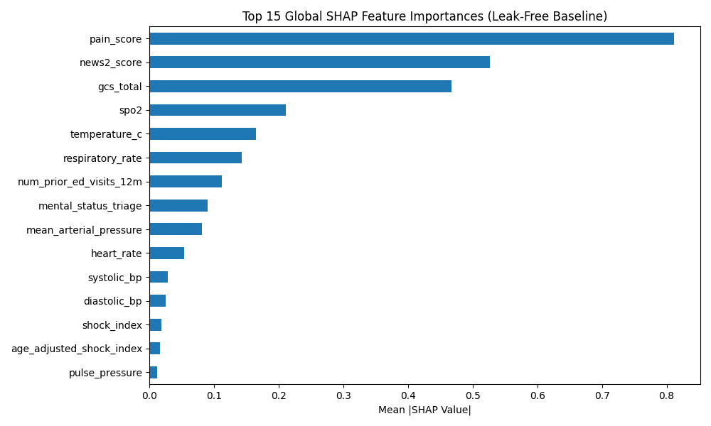

# Holistic AI Suite: Multi Signal Synergy Stacker and Calibrated Selective Risk

**Subtitle:** A competition grade triage pipeline that combines physiological ensembles, synthetic complaint text signals, grouped stacking, conservative QWK tuning, and CARES selective risk estimates.

**Public Notebook:** TriageGeist Holistic Suite  
**Public Project Link:** GitHub Repository

### Clinical Problem Statement

Emergency triage is a high pressure clinical decision setting where assigning a patient to the wrong acuity level can delay care. The most serious failure mode is **undertriage**, where a patient who needs urgent intervention is assigned a lower acuity score. Overtriage can consume hospital resources, but undertriage can directly increase clinical risk.

The Triagegeist dataset also exposes a second challenge. In a synthetic competition setting, very high statistical scores can be achieved by learning artifacts from generated text templates rather than by learning generalizable physiological patterns. A clinically useful model should therefore separate two goals: maximizing the Kaggle metric on the given data distribution, and maintaining an interpretable physiological track that can be audited independently.

Our solution addresses this by building a secondary triage verification system. The model does not replace the triage nurse. It provides an additional prediction layer that combines objective physiological measurements with complaint text, tracks undertriage risk, and uses selective risk estimates to identify cases where automated prediction should be treated with caution.

### Approach and Methodology

To balance leaderboard performance with clinical interpretability, we built a multi signal calibrated stacker with separate physiological and text driven components.

### 1. Semantic Grouping and Physiology Track

To reduce validation leakage from repeated complaint templates, we normalized the raw complaint text and created semantic groups using KMeans clustering on character TF IDF representations. We then used `StratifiedGroupKFold` with these semantic clusters as groups. This creates a stricter hidden split simulation where related complaint phrases are less likely to appear in both training and validation folds.

The physiological track explicitly excludes target proxy variables such as `disposition`. It is built from LightGBM, CatBoost, and XGBoost models trained on structured clinical features. Instead of applying ordinal encoding to categorical columns, we pass categorical data directly into the tree algorithms through native categorical handling. The models are trained with deeper estimator budgets and early stopping.

Missing physiological measurements are treated as signal rather than noise. In emergency department workflows, missingness is often Missing Not At Random. We therefore add explicit missingness indicators and allow tree based models to split on missing values where supported.

### 2. Parametric NLP Track With Word and Character Signals

The raw complaint text contains strong synthetic template information. To capture this signal while improving robustness to spelling variation and phrase drift, the NLP branch uses a sparse union of word TF IDF and character TF IDF features through `scipy.sparse.hstack`.

A `RidgeClassifier` is wrapped in `CalibratedClassifierCV` with `method='sigmoid'`. This produces calibrated probability estimates using Platt scaling instead of relying on raw classifier margins. We use sigmoid calibration rather than isotonic calibration because the parametric form is less prone to overfitting in small calibration slices.

### 3. Grouped Meta Learner

The physiological and NLP branches produce out of fold probability features. A Logistic Regression meta learner is then trained on those probability features. To avoid optimistic level two evaluation, the stacker is evaluated using `cross_val_predict` under the same semantic group structure.

This means the reported grouped meta score is based on predictions made for rows that were unseen by the meta learner during the corresponding fold. This allows the stacker to learn when the structured model is useful and when the synthetic text signal is more reliable, while keeping the validation protocol stricter than ordinary random folds.

### 4. Conservative Powell Bias Tuning

Quadratic Weighted Kappa is sensitive to ordinal boundary decisions. A pure `np.argmax()` over class probabilities may not be the best decision rule for this metric. We therefore evaluate class bias tuning with `scipy.optimize.minimize` using the Powell method.

To avoid overfitting the validation surface, the tuned score is evaluated inside grouped outer folds. The tuned result is reported separately from the grouped meta learner score. This distinction matters because the grouped meta learner achieved the stronger direct validation score, while nested Powell tuning provides a more conservative estimate of post processing stability.

### 5. Fairness and Undertriage Audit

The pipeline includes an undertriage audit for elderly patients. During inference, the system can scan probability shifts for the elderly cohort and choose a conservative adjustment that reduces undertriage risk. The adjustment is applied at the end of the prediction path so it is not overwritten by later model decisions.

This is treated as a clinical safety audit, not as proof of fairness in deployment. A real hospital setting would require prospective validation across patient groups, language groups, and site specific triage procedures.

### 6. CARES Selective Risk Estimation

The CARES layer estimates selective risk using Clopper Pearson upper bounds on out of fold correctness. Rather than claiming deployment guarantees, CARES reports whether the model can automate predictions while keeping the empirical upper bound error below a target threshold.

In the executed notebook, the selective risk audit indicates that the model can automate 100.00% of validation cases while keeping the upper bound error below 5%. This result is evidence of strong validation reliability on the current dataset, but it should not be interpreted as a real world clinical guarantee without external validation.

### Results and Findings

On the executed notebook, the final validation results are:

**Physiology track QWK:** `0.9291`  
**Calibrated NLP track QWK:** `0.9829`  
**Grouped meta learner QWK:** `0.9930`  
**Nested Powell tuned QWK:** `0.9889`  
**Base accuracy:** `98.80%`

The physiology track performs strongly without using direct target proxy variables. This supports the claim that the structured clinical features contain meaningful signal. The NLP branch performs better because the complaint text captures the synthetic generation patterns in the competition data. The grouped meta learner achieves the strongest validation score by combining both signals under semantic group splits.

The nested Powell tuned score is lower than the grouped meta learner score, which is an important finding. It shows that post processing should be treated conservatively. For final submission generation, a global class bias can still be fit after validation, but the most honest reported estimate is the nested result.

The asymmetric clinical cost audit shows that undertriage accounts for `64.2%` of the remaining residual error cost. Since the total remaining error is small, this does not mean the model is unsafe, but it does show that the residual mistakes are clinically meaningful and should be monitored.

SHAP analysis on the physiological branch identifies clinically plausible drivers such as `pain_score`, `news2_score`, `gcs_total`, and `spo2`. This supports the interpretability value of keeping a separate physiological model even when the competition score is dominated by complaint text.

### Limitations and Future Work

The main limitation is that the highest scoring branch relies on synthetic complaint templates. This makes the system effective for the Kaggle task, but the NLP branch should not be used as evidence of real world clinical generalization. Moving toward deployment would require discarding or retraining the text branch on real triage notes from the target hospital setting.

The second limitation is missingness dependence. Missing physiological measurements are highly predictive in this dataset, but that relationship may change in hospitals that require full measurements for every patient. A site with different triage protocols could weaken this signal.

The third limitation is demographic and language group stability. The notebook includes a language group audit, including higher observed error for Arabic speaking patients than Finnish speaking patients. This finding should be treated as a prompt for targeted validation rather than as a solved fairness issue.

Finally, CARES provides an empirical validation bound, not a clinical guarantee. For deployment, selective risk control would need a separate calibration cohort, prospective monitoring, and repeated audits after any shift in patient population or documentation style.

### Reproducibility Notes

The notebook executes the complete pipeline, including semantic grouping, native categorical handling, word and character TF IDF construction, calibrated NLP modeling, grouped meta validation, nested Powell tuning, CARES selective risk estimation, and submission generation.

The final submission file is generated from models fit on the full training data after validation. No external clinical datasets were used.

### Data Citation

Olaf Yunus Laitinen Imanov, Triagegeist, Kaggle, 2026. We confirm that our use of the Triagegeist dataset complies with its terms of access. No external datasets such as MIMIC IV ED were used in building this submission.